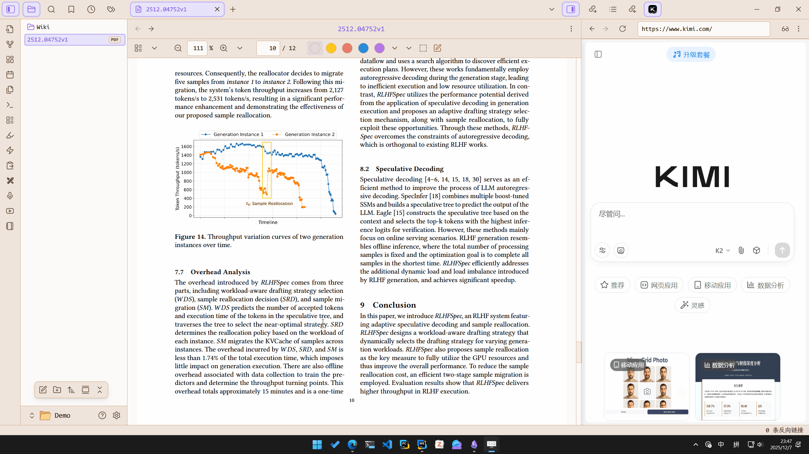
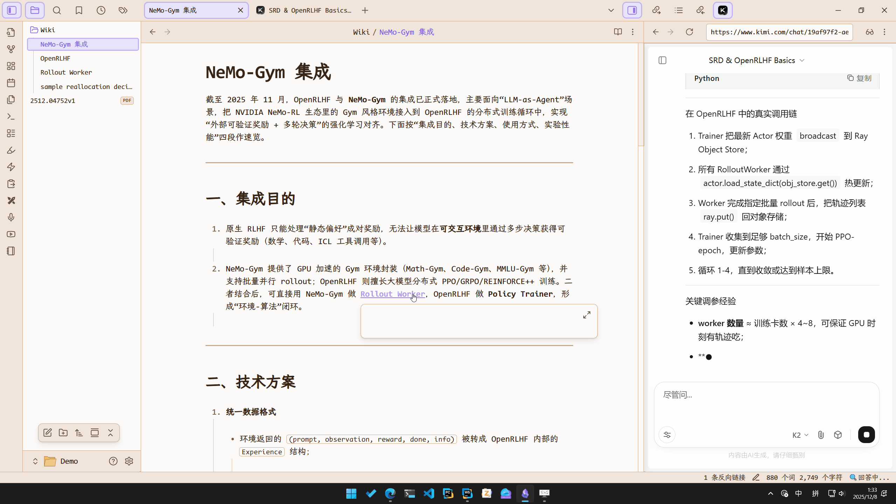
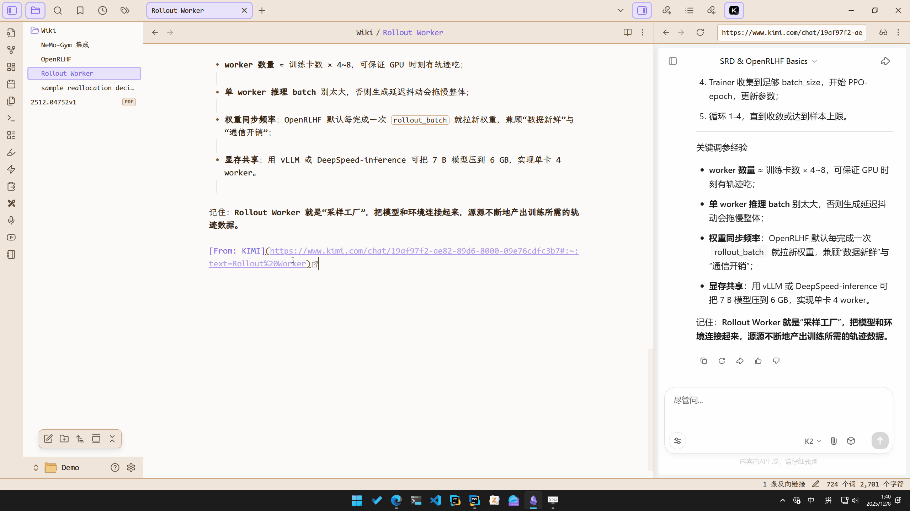
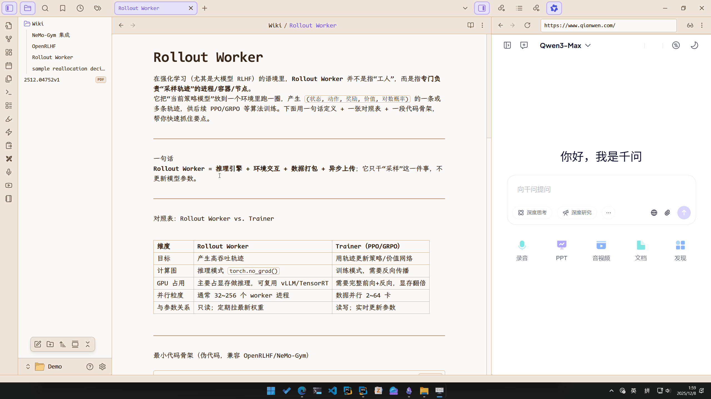
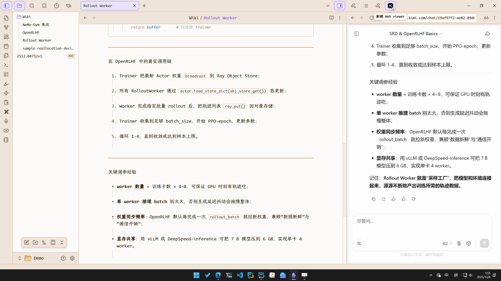
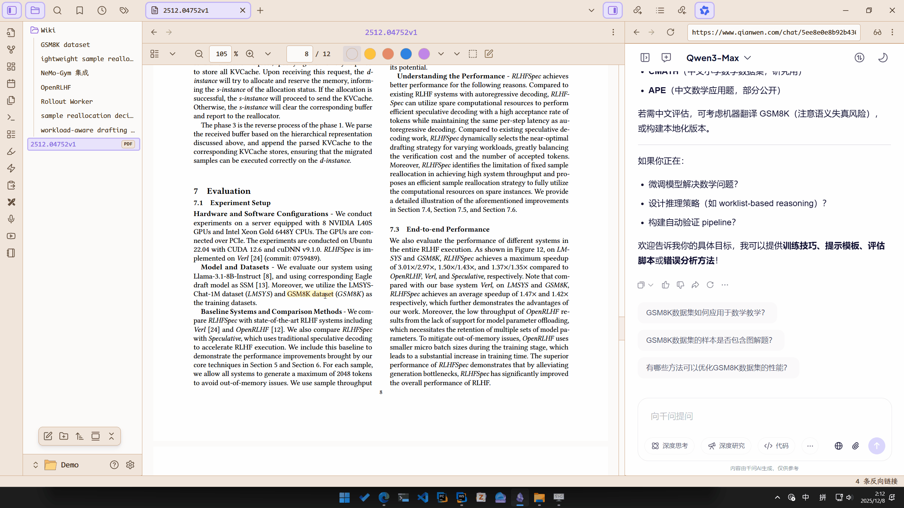

# Obsidian WebLLMate

将主流LLM网站主页无缝集成到 [Obsidian](https://obsidian.md)的智能插件。

## 插件介绍 ✨

在笔记和PDF中选择文本，自动填入侧边栏LLM网页并开启聊天，并将回答结果保存至wiki笔记，在原文创建引用链接。



> **开发初衷**: 最近看论文或相关笔记时会经常遇到不太了解的名词，之前的工作流是：
> 1. 复制文本；
> 2. 打开KIMI等网站进行回答；
> 3. 复制回答到笔记
>
> 但是感觉整个流程比较重复。于是便把整个流程写成了自动化插件。

## 核心功能 🎯

- ⚡ 快捷提问：支持快捷键、右键菜单、工具栏一键对划选文本发起提问
- 🔗 WIKI引用：回答完成后自动生成WIKI笔记，并在划选处创建双向引用链接
- 🔄 回溯链接：WIKI末尾自动添加本次对话的URL链接，方便追溯源头
- 🔍 历史记录搜索：快速打开历史记录并搜索指定内容
- 🌐 多平台适配：深度适配 KIMI、Qwen、YuanBao、ChatGPT 等主流平台
- 📄 PDF++增强：强烈推荐搭配 [PDF++](https://github.com/RyotaUshio/obsidian-pdf-plus) 插件使用，体验更佳

### 快捷提问 ⚡


### WIKI引用 🔗



### 回溯链接 🔄



### 历史记录搜索 🔍



### 多平台适配 🌐



### PDF++增强 📄

搭配[PDF++](https://github.com/RyotaUshio/obsidian-pdf-plus)插件使用，划线后高亮选择内容，创建双向引用PDF链接



### 补充说明 💡

插件“**特色**”

- 💰 零成本：~~各家网站主页都有免费额度可用~~
- 🎨 高颜值：~~各家网站的主页UI设计都很出色~~
- 🌍 跨平台：~~聊天记录支持企业级跨平台同步~~

> ⚠️注意：本插件适合LLM轻度使用场景，重度使用场景建议使用API。

## 路线图 🗺️

- [ ] 支持自动上传图片/文件开启多模态对话（最近发现多模态大模型识别公式很准）
- [ ] 构建上层应用（可以将整个流程抽象为一个LLM接口调用，实现Function Call等能力）
- [ ] ......

## 适配器开发 🔧

开发适配器需要实现`src/types.ts/`的`WebLLMAdapter`接口，推荐继承 `src/adapters/bases/` 下的基类快速开发。

基类内置了`executor: WebExecutor`属性，提供链式API便捷操作DOM元素。

举个🌰：

```typescript
const html = await this.executor
	.waitFor(selector1) // 等待元素出现
	.queryAll(selector2, global = true) // 全局查询元素列表
	.at(-1) // 取最后一个元素
	.query(selector3) // 元素内查询
	.html() // 获取innerHTML
	.done(); // 完成脚本构建并执行
```

> 每次链式调用不会立即执行，而是拼接脚本，最终调用 done() 方法后统一执行。  
> 详见 `src/utils/webviewer/WebExecutor.ts`.

## 支持项目 💝

如果本项目对你有帮助，欢迎赞助支持：  
爱发电： http://afdian.com/a/lumosmoon  
引力圈： https://app.unifans.io/c/lumosmoon

### ## 致谢 🙏

感谢 [KIMI](https://www.kimi.com/)、[Qwen](https://www.qianwen.com/)、[YuanBao](https://yuanbao.tencent.com/)、[ChatGPT](https://chatgpt.com/)
等平台提供的优秀服务，本插件基于这些平台的网页版构建。
